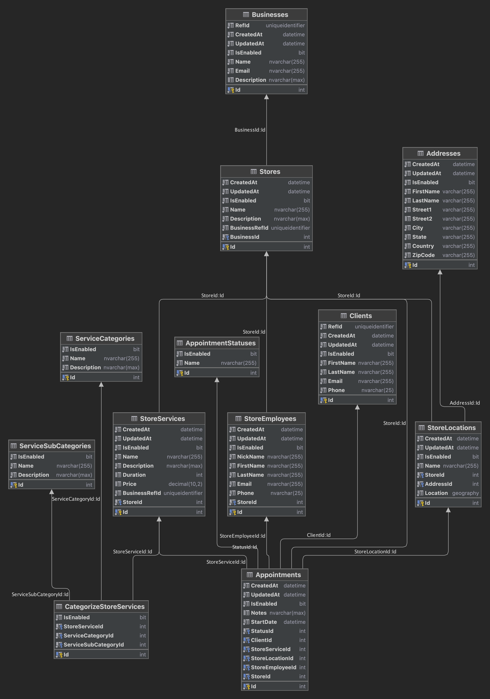

# CRM Application

A comprehensive Customer Relationship Management (CRM) application designed for businesses to manage their stores, employees, and services across multiple locations. The app also enables clients to discover nearby services and book appointments.

## Table of Contents

1. [Introduction](#introduction)
2. [Features](#features)
3. [Tech Stack](#tech-stack)
4. [Architecture](#architecture)
5. [Installation](#installation)
6. [Usage](#usage)
7. [API Documentation](#api-documentation)
8. [Database Schema](#database-schema)
9. [Deployment](#deployment)
10. [Contributing](#contributing)
11. [License](#license)
12. [Contact](#contact)

## Introduction

The CRM Application provides a platform for businesses to efficiently manage their operations across multiple locations. It facilitates the addition of stores, employee management, and service offerings. Clients can easily find and book services, ensuring a seamless experience.

## Features

### For Businesses
- **Business Registration:** Register your business on the platform.
- **Store Management:** Add and manage stores in various locations.
- **Employee Management:** Assign and manage employees for each store.
- **Service Management:** Define and categorize services offered at each store.

### For Clients
- **Client Registration:** Clients can register and create profiles.
- **Service Discovery:** Find services based on location and other filters.
- **Appointment Booking:** Book appointments with businesses for various services.

## Tech Stack

- **Frontend:** Next.js
- **Backend:** .NET 8 (Isolated Worker), Azure Functions v4
- **Database:** SQL Server, Cosmos DB (for availability data)
- **Authentication:** Azure AD B2C
- **Configuration & Secrets Management:** Azure App Configuration, Azure Key Vault
- **API Documentation:** OpenAPI
- **Hosting:** Microsoft Azure

## Architecture

The CRM Application follows a microservices architecture with a serverless backend. The frontend is built with Next.js for a responsive and interactive user experience. The backend utilizes Azure Functions (v4) and .NET 8 isolated worker for scalable serverless computing, with SQL Server and Cosmos DB for data storage.

  <!-- Replace with the actual image -->

## Installation

### Prerequisites
- Node.js
- .NET 8 SDK
- Azure account

### Setup

1. Clone the repository:
   ```bash
   git clone https://github.com/your-repo/crm-app.git
   ```
2. Install frontend dependencies:
   ```bash
   cd frontend
   npm install
   ```
3. Configure backend services, including Azure App Configuration and Key Vault, and deploy them to Azure.

## Usage

1. **Start the frontend:**
   ```bash
   cd frontend
   npm run dev
   ```
2. **Backend services:** Deploy to Azure and ensure they are running.

## API Documentation

The application exposes various APIs for managing business operations and client interactions. The API documentation, generated using OpenAPI, provides detailed information on available endpoints, request/response formats, and usage examples.

## Database Schema

The database schema includes tables for businesses, stores, employees, services, and appointments. Below is a visual representation of the schema:


## Deployment

The application is deployed on Microsoft Azure, utilizing Azure Functions for serverless backend services and Azure Cosmos DB for scalable database management. CI/CD pipelines are set up using Azure DevOps for seamless deployment.

## Contributing

We welcome contributions from the community. Please read our Contributing Guidelines to learn how to get involved.

## License

This project is licensed under the MIT License. See the LICENSE file for more details.

## Contact

For inquiries or support, please contact us at [support@example.com](mailto:support@example.com).

---

Thank you for using our CRM Application! We hope it helps streamline your business operations and enhances client interactions.


# CRM API Business Identity Azure Function

This Azure Function handles identity-related operations for the CRM API, specifically dealing with Azure Active Directory B2C callback functions. It manages the registration and update of business entities based on authentication and authorization processes using `authorization_code`.

## Endpoints

### PostRegister

- **Route:** `GET /post-register`, `POST /post-register`
- **Description:**
   - This endpoint is called by Azure AD B2C after a successful sign-up or sign-in.
   - It verifies the `authorization_code`, retrieves an `id_token`, and creates a new business entity in the database.
   - **Response:**
      - On success, redirects to a specified URI with an HTTP status code of 302 (Redirect).
      - On failure, returns an HTTP status code of 401 (Unauthorized).

### PostUpdate

- **Route:** `GET /post-update`, `POST /post-update`
- **Description:**
   - This endpoint is called by Azure AD B2C after a successful profile edit.
   - It verifies the `authorization_code`, retrieves an `id_token`, and updates the business entity in the database.
   - **Response:**
      - On success, redirects to a specified URI with an HTTP status code of 302 (Redirect).
      - On failure, returns an HTTP status code of 401 (Unauthorized).

## Authentication and Authorization

Both endpoints require an `authorization_code` provided by Azure AD B2C, which is used to authenticate and authorize the operation. The `authorization_code` is passed as a query parameter and is validated before processing.

## Dependencies

- **IIdentityService:** Service for handling identity verification and processing.
- **IdentityOptions:** Configuration options for identity services, including redirect URIs.

## License

This project is licensed under the MIT License.


# CRM API Business Management Azure Function

This Azure Function serves as the backend for managing stores, employees, and services for a business. It provides a set of HTTP endpoints for performing CRUD operations on stores, employees, and services, with JWT-based authentication and authorization.

## Endpoints

### Store Endpoints

1. **Get All Stores**
    - **Route:** `GET /store/get-all`
    - **Description:** Retrieves all stores associated with the authenticated business.

2. **Get Store**
    - **Route:** `GET /store/get/{storeId}`
    - **Description:** Retrieves a specific store by its ID.

3. **Add Store**
    - **Route:** `POST /store/add`
    - **Description:** Adds a new store to the business.

4. **Edit Store**
    - **Route:** `PATCH /store/edit`
    - **Description:** Edits an existing store's details.

5. **Delete Store**
    - **Route:** `DELETE /store/delete/{storeId}`
    - **Description:** Deletes a store from the business.

### Employee Endpoints

1. **Get All Employees**
    - **Route:** `GET /employee/get-all`
    - **Description:** Retrieves all employees associated with the business.

2. **Add Employee**
    - **Route:** `POST /employee/add/{storeId}`
    - **Description:** Adds a new employee to a specified store.

3. **Edit Employee**
    - **Route:** `PATCH /employee/edit`
    - **Description:** Edits an existing employee's details.

4. **Delete Employee**
    - **Route:** `DELETE /employee/delete/{employeeId}`
    - **Description:** Deletes an employee from the business.

### Service Endpoints

1. **Get All Service Categories**
    - **Route:** `GET /service/category/get`
    - **Description:** Retrieves all system-defined service categories and subcategories.

2. **Get Store Services**
    - **Route:** `GET /service/{storeId}/get`
    - **Description:** Retrieves all services provided by a specified store.

3. **Add Service**
    - **Route:** `POST /service/{storeId}/add`
    - **Description:** Adds a new service to a specified store.

4. **Edit Service**
    - **Route:** `PATCH /service/edit`
    - **Description:** Edits an existing service's details.

5. **Delete Service**
    - **Route:** `DELETE /service/{serviceId}/delete`
    - **Description:** Deletes a service from a store.

## Authentication and Authorization

All endpoints require JWT-based authentication. The JWT token must be included in the request header, and the `businessRefId` must be validated to ensure the request is authorized to access the specific resources.

## Dependencies

- **IJwtValidatorService:** Service for validating and authorizing JWT tokens.
- **IManagementService:** Service for managing stores, employees, and services.
- **IHttpRequestBodyMapper:** Utility for mapping and validating request bodies.

## Notes

- The functions use the [Microsoft.Azure.Functions.Worker](https://www.nuget.org/packages/Microsoft.Azure.Functions.Worker/) package for Azure Functions.
- OpenAPI annotations are used for API documentation.

## License

This project is licensed under the MIT License.


# CRM API Client Service Azure Function

This Azure Function provides endpoints for retrieving information about services available within a specified range and filter criteria. It serves as the backend for querying service-related data.

## Endpoints

### Get All Services

- **Route:** `GET /services/get-all`
- **Description:**
   - Retrieves a list of services within a specified range and based on filter query parameters.
   - **Response:**
      - On success, returns a list of services in JSON format with an HTTP status code of 200 (OK).

### Get Service by ID

- **Route:** `GET /services/get/{serviceId}`
- **Description:**
   - Retrieves a specific service based on its ID.
   - **Path Parameter:**
      - `serviceId` (int): The ID of the service to retrieve.
   - **Response:**
      - On success, returns the service details in JSON format with an HTTP status code of 200 (OK).
      - On failure, returns an HTTP status code of 404 (Not Found) if the service does not exist.

## Authentication

Both endpoints are accessible without authentication (`AuthorizationLevel.Anonymous`), meaning they can be called publicly.

## Dependencies

- **IServiceService:** Service for handling service-related data retrieval and manipulation.
- **ILogger<ServiceFunction>:** Logger for capturing log details.

## License

This project is licensed under the MIT License.


## Tech Stack and Technologies

- **Azure Functions:** Serverless compute service that allows the execution of event-driven code, enabling the development of scalable and efficient applications. It is used to deploy and manage these HTTP-triggered functions.
- **.NET 6:** The latest version of the .NET framework, providing a unified platform for building applications. The function app leverages the .NET 6 runtime for optimal performance and compatibility.
- **Microsoft Azure:** The cloud platform providing hosting and management for the Azure Functions, ensuring high availability and scalability.
- **OpenAPI Annotations:** Used for documenting the API endpoints, providing a standardized way to describe the HTTP methods, parameters, and responses. This helps in generating API documentation and client SDKs.
- **IServiceService Interface:** Defines the contract for the service layer, handling business logic and data retrieval related to services.
- **ILogger Interface:** Provides logging capabilities to capture and store logs for monitoring and debugging purposes.

## Dependencies

- **Newtonsoft.Json:** A popular high-performance JSON framework for .NET used for serializing and deserializing objects to and from JSON.
- **Microsoft.AspNetCore.WebUtilities:** A utility library for ASP.NET Core, used here for parsing query strings from HTTP requests.

## Deployment

The function app is deployed on Microsoft Azure, utilizing Azure Functions for serverless computing. Azure's cloud infrastructure ensures that the app scales automatically based on demand, providing cost-effective and efficient operation.

## License

This project is licensed under the MIT License.

## Database Schema

The database schema for the CRM API Client Service is depicted below:


